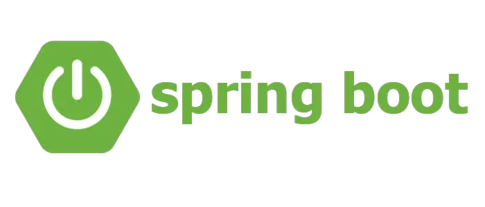

# Java Spring Boot

This project is a boilerplate for building full stack applications using Java Spring Boot.



## Features

- Java Spring Boot REST API backend
- Example CRUD operations
- Easy setup and development workflow

## Getting Started

### Prerequisites

- Node.js & npm
- Java 17+
- Maven

### Running the Application

Navigate to the `server` directory and run:

```bash
mvn spring-boot:run
```

## Folder Structure

```
/server    # Spring Boot app
```

## License

This project is licensed under the MIT License.
